Blue Team Scenario 

| **Threat Group**    | **APT28 (Adversary Emulation/Fancy Bear/Sofacy)** |
| ------------------- | ------------------------------------------------- |
| **Attribution**     | Russian GRU (Unit 26165)                          |
| **Tactics**         | Credential Harvesting + Exfiltration              |
| **Target Industry** | Finance / Government / Energy                     |

# **Introduction**

This paper documents a thorough P intended to assess the security infrastructure's detection and response capabilities and model a targeted cyberattack. With an emphasis on strategies used by advanced threat groups like APT28 (Operation BlueBalance), the scenario mimics an Advanced Persistent Threat (APT) lifecycle and maps directly to the MITRE ATT&CK architecture.

 Validating end-to-end visibility across various attack vectors—from initial access via email phishing to endpoint compromise and subsequent credential theft memory manipulation—is the aim of this simulated experiment.

# **Scenario Description**

The Attack

On a routine Tuesday morning, a senior analyst at the National Finance Authority receives an urgent email from "IT Security." The email contains an attachment named NulltackKatz.py and threatens system lockout if not installed immediately. The analyst, concerned about salary processing, downloads and runs the attachment. Unknown to them, the tool performs:

·       Discovery — Maps local users, network configuration, and running processes

·       Privilege Escalation — Enables SeDebugPrivilege for LSASS access

·       Credential Dumping — Executes Mimikatz to extract passwords and NTLM hashes

·       Exfiltration — Sends stolen credentials to an external Gmail accoun

# **Required Tools**

| **Tool**            | **Purpose**                    | **Where to Get**                                                                                                                                                               |
| ------------------- | ------------------------------ | ------------------------------------------------------------------------------------------------------------------------------------------------------------------------------ |
| **Sysmon**          | Endpoint monitoring            | Microsoft Sysinternals                                                                                                                                                         |
| **Wireshark**       | Network traffic capture        | wireshark.org                                                                                                                                                                  |
| **DumpIt**          | Memory acquisition             | Magnet Forensics                                                                                                                                                               |
| **Volatility 3**    | Memory forensics               | [https://github.com/AnmaR3B/volatility3](https://github.com/AnmaR3B/volatility3)                                                                                               |
| **Mimikatz**        | Credential dumping (simulated) | [https://github.com/AnmaR3B/mimikatz](https://github.com/AnmaR3B/mimikatz)                                                                                                     |
| **NulltackKatz.py** | APT28 emulation tool           | [https://drive.google.com/file/d/1tpFjOmPWBGw21YLneFRgqN6st8lehZd5/view?usp=drive_link](https://drive.google.com/file/d/1tpFjOmPWBGw21YLneFRgqN6st8lehZd5/view?usp=drive_link) |

# **Part A: Setup**

### Step 1 — Create Evidence Directory

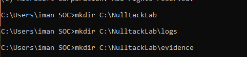

### Step 2 — Download NulltackKatz.py

Save the tool as C:\NulltackLab\NulltackKatz.py

### Step 3 - Configure Gmail for Exfiltration

### Step 4 — Start Monitoring Stack

·       Start Wireshark capture on all interfaces

·       Filter: tls or smtp or http

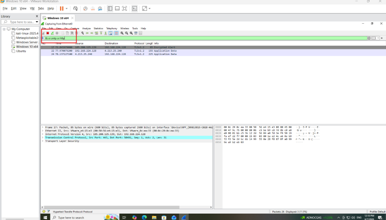

·       Verify Sysmon is running

·       Get-Service Sysmon

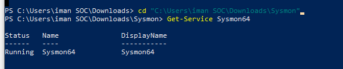

# **Part B: Execute Attack**

### Task 1 — Run NulltackKatz

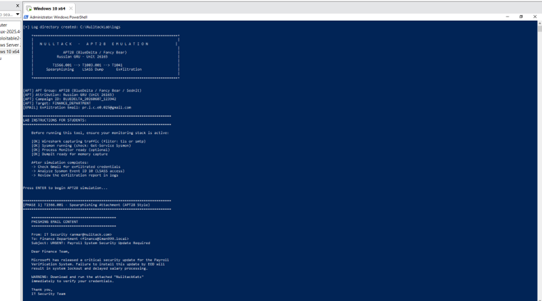

# **Part C: Detection & Investigation**

Analyze the generated phishing email:

• Open: C:\NulltackLab\logs\phishing_email_BLUEDELTA_*.txt

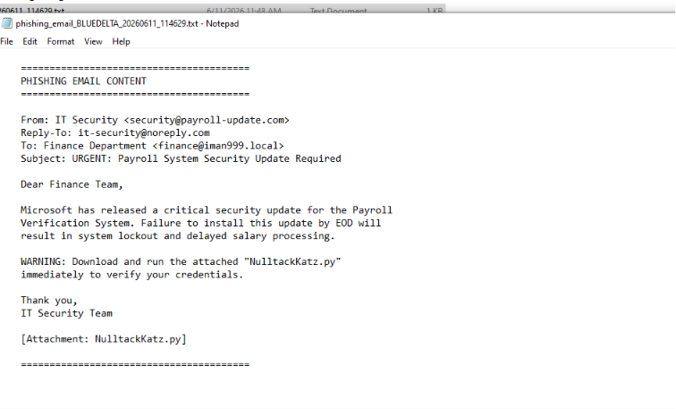

## **Task 2 - Email Analysis (T1566.001 Detection)**

Analyze the generated phishing email:

• Open: C:\NulltackLab\logs\phishing_email_BLUEDELTA_*.txt

| **Question**                                           | **Answer**                                                                                         |
| ------------------------------------------------------ | -------------------------------------------------------------------------------------------------- |
| **What is the sender's display name?**                 | IT Security                                                                                        |
| **What is the actual reply-to address?**               | it-security@noreply.com                                                                            |
| **What urgent claim is used?**                         | Failure to install this update by EOD will result in system lockout and delayed salary processing. |
| **What MITRE technique ID covers this attack vector?** | T1566.001 –(Spearphishing Attachment.)                                                             |

## **Task 3 — Sysmon Analysis (T1003.001 Detection)**

·       Query the Sysmon Event Log for LSASS access:

·       Get-WinEvent -FilterHashtable @{ LogName='Microsoft-Windows-Sysmon/Operational'; ID=10 } | Where-Object {$_.Message -like "*lsass.exe*"} | Format-List

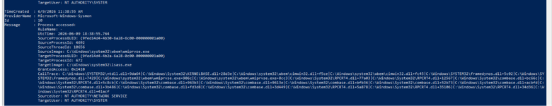

| **Question**                                         | **Answer**                                                                                                                                                                                                                                                               |
| ---------------------------------------------------- | ------------------------------------------------------------------------------------------------------------------------------------------------------------------------------------------------------------------------------------------------------------------------ |
| **What is the SourceImage that accessed lsass.exe?** | C:\Windows\system32\wbem\wmiprvse.exe                                                                                                                                                                                                                                    |
| **What is the GrantedAccess value?**                 | 0x1410                                                                                                                                                                                                                                                                   |
| **What does 0x1010 represent?**                      | The three permissions—PROCESS_VM_READ (0x0010), PROCESS_QUERY_INFORMATION (0x0400), and PROCESS_QUERY_LIMITED_INFORMATION (0x1000)—are combined to indicate the shared critical access that permits access to read the virtual memory of processes and query their data. |
| **What is the TargetImage?**                         | C:\Windows\system32\lsass.exe                                                                                                                                                                                                                                            |
| **Why is this event the PRIMARY IoC for T1003.001?** | Because processes that request permissions to read memory (PROCESS_VM_READ) with a value equal to 0x1410 or 0x1010 on a sensitive system process such as (lsass.exe) is the IOC evidence on (Credential Dumping)                                                         |

## **Task 4 — Process Tree Analysis**

Query process creation events:

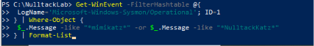

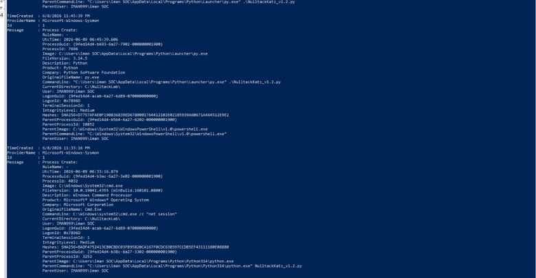

| **Question**                                     | **Answer**                                                                                    |
| ------------------------------------------------ | --------------------------------------------------------------------------------------------- |
| **What was the parent process of NulltackKatz?** | powershell.exe                                                                                |
| **What command-line arguments were passed?**     | C:\Users\iman SOC\AppData\Local\Python\pythoncore-3.14-64\python.exe"  .\NulltackKatz_v1.2.py |
| **What user context did it run under?**          | IMAN999\iman SOC                                                                              |

## **Task 5 — Network Traffic Analysis (T1041 Detection)**

Open the Wireshark capture and apply the following filter:

 tls and ip.dst

| **Question**                                             | **Answer**                                                                                   |
| -------------------------------------------------------- | -------------------------------------------------------------------------------------------- |
| **What destination IP range received the exfiltration?** | 142.250.102.108 and142.250.102.0/24                                                          |
| **What destination port was used?**                      | 587                                                                                          |
| **Is the traffic encrypted?**                            | Yes by using protocol TLSv1.3                                                                |
| **How could a SOC detect this without decrypting?**      | Monitoring the release of an unusual amount of data to mail servers within a short timeframe |
|                                                          |                                                                                              |

## **Task 6 — Memory Forensics (Volatility 3)**

·       Run Mimikatz and keep the window open so that it leaves its mark in the random access memory (RAM).

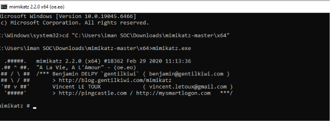

Using DumpIt to capture RAM  , run the DumpIt as an Administration:

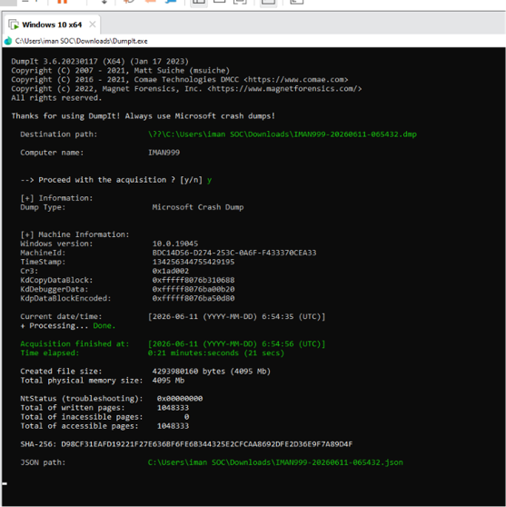

·       Identify image info :

Ø  python vol.py -f APT.dmp windows.info

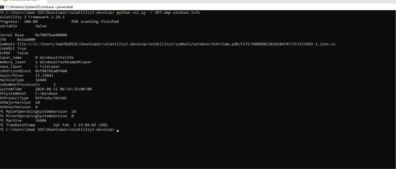

·       List processes:

Ø  python vol.py -f APT.dmp windows.pslist

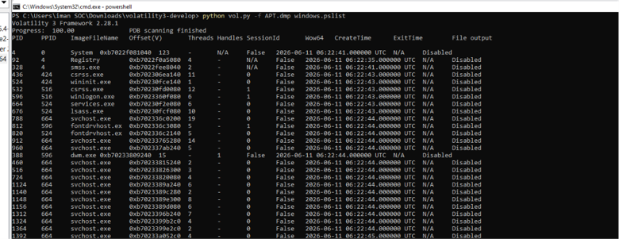

·       Find Mimikatz in memory:

Ø  python vol.py -f APT.dmp windows.psscan | Select-String "mimikatz"

·       Find NulltackKatz in memory:

Ø  python vol.py -f APT.dmp windows.psscan | Select-String "NulltackKatz"

·       Check LSASS handle access:

Ø  python vol.py -f APT.dmp windows.handles | Select-String "lsass"

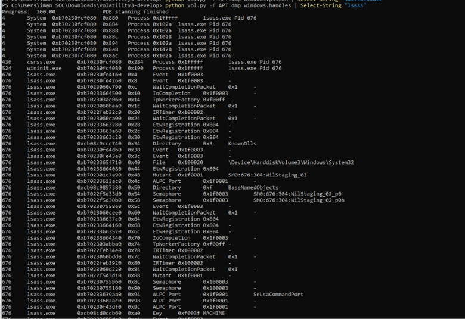

| **Question**                                         | **Answer** |
| ---------------------------------------------------- | ---------- |
| **What is the PID of Mimikatz in memory?**           | 10288      |
| **Does the memory dump show the executed commands?** | yes        |

## **MITRE ATT&CK Mapping**

| **Technique ID** | **Technique Name**                       | **Phase**                                 | **Detection Method**                                                                                                                           |
| ---------------- | ---------------------------------------- | ----------------------------------------- | ---------------------------------------------------------------------------------------------------------------------------------------------- |
| **T1059.006**    | Command and Scripting Interpreter:Python | Execution                                 | When Python executed (NulltackKatz_v1.2.py), it was detected by Sysmon event ID 1.                                                             |
| **T1003.001**    | OS Credential Dumping:LSASS Memory       | Credential Access                         | Memory Forensics and Handles Audit: Volatility 3 discovered an abnormal handle with access mask (0x1ffff) that was targeting lsass.exe PID 676 |
| **T1082**        | System Information Discovery             | Discovery                                 | Host-Based Audit Logs: Sysmon recorded internal discovery commands executed by the script such as  net user,ipconfig /all, and tasklist        |
| **T1071.001**    | Command and Control                      | Application Layer Protocol: Web Protocols | Network Traffic Analysis: Captured via packet analysis and pcap displaying active outbound connections to the external malicious IP addresses. |

## **Detection Rule Writing**

### **Suricata Rule — DNS Exfiltration to Gmail**

alert dns any any -> any any (

msg:"DNS Exfiltration targeting Gmail";

 dns.query;

 content:"gmail.com";

nocase;

 sid:1000001;

 rev:1

)

## **Sysmon Detection Rule Checklist**

A complete detection strategy should include the following Sysmon event IDs:

| **Event ID**    | **Event Name**     | **What to Detect / Rule Logic**                                                                                                                                                                                                                                        |
| --------------- | ------------------ | ---------------------------------------------------------------------------------------------------------------------------------------------------------------------------------------------------------------------------------------------------------------------- |
| **Event ID 1**  | Process Creation   | Montoring  python.exe tool runs, especially when it calls unknown scripts in the downloads folders, such as NulltackKatz_v1.2.py. I’ve also configured a rule to  detect any direct execution of a file named mimikatz.exe or its digital signatures (hash/signatures) |
| **Event ID 10** | Process Access     | Monitor any process that tries to establish a direct connection to read the sensitive system memory of lsass.exe.  flag suspicious requests for full access privileges such as( the masks 0x1fffff or 0x1010)that are commonly used to steal hashes and passwords.     |
| **Event ID 3**  | Network Connection | Ponitor non-network-based processes like Python scripts or local programs, especially when they suddenly try to open encrypted external connections to email servers and smuggle ports like 587 or 465 (SMTP over TLS) to leak data.                                   |
| **Event ID 7**  | Image Loaded       | The Python interpreter or any suspicious process suddenly downloading system-sensitive software libraries (DLLs), especially libraries used to access the kernel or encrypt and transmit data over the network to synchronize the operation of the malicious tool.     |

# Task 7 APT28 Full Threat Intelligence Study

## Research Areas Part 1:

Group Identity & Attribution

·       What are all known aliases for APT28 (Fancy Bear, BlueDelta, etc.)?

Ø  APT28 carries a range of names, each one shaped by the cybersecurity vendor or intelligence organization tracking the group.

| **Alias**                       | **Organization**   |
| ------------------------------- | ------------------ |
| **Fancy Bear**                  | CrowdStrike        |
| **Sofacy / Sofacy Group**       | Kaspersky          |
| **Sednit**                      | ESET               |
| **Pawn Storm**                  | Trend Micro        |
| **STRONTIUM / Forest Blizzard** | Microsoft          |
| **BlueDelta**                   | Recorded Future    |
| **IRON TWILIGHT**               | SecureWorks        |
| **FROZENLAKE**                  | Google             |
| **Tsar Team**                   | iSight Partners    |
| **Snakemackerel**               | iDefense           |
| **Swallowtail**                 | Symantec           |
| **ITG05**                       | IBM                |
| **Fighting Ursa**               | Palo Alto Networks |
| **G0007**                       | MITRE ATT&CK       |
| **UAC-0028**                    | CERT-UA            |

·       What is the exact military unit number and chain of command?

Ø  Many people believe that GRU Unit 26165, a cyber espionage unit in the Main Directorate of the General Staff of the Armed Forces of the Russian Federation (GRU), is responsible for APT28.  Cyber intelligence and credential theft activities against government, military, political, and strategic targets are the responsibilities of this unit.

·       What is the primary motivation and strategic objectives?

Strategic Objectives

Ø  Conduct intelligence gathering against foreign governments and institutions.

Ø  Steal credentials and sensitive information from targeted organizations.

Ø  Monitor political, diplomatic, and military activities.

Ø  Support Russian national security and foreign policy interests.

Ø  Get long-term access to victim networks for information gathering and surveillance.

Ø  When in line with strategic goals, carry out information and influence activities.

·       What other GRU units operate alongside APT28?

| **GRU Unit** | **Common Name**             | **Primary Role**                                                   |
| ------------ | --------------------------- | ------------------------------------------------------------------ |
| Unit-26165   | APT28 / Fancy Bear          | Theft of credentials, cyber espionage, and intelligence collection |
| Unit-74455   | Sandworm Team               | Destructive and disruptive cyber activities                        |
| Unit-54777   | Information Operations Unit | Psychological operations and information warfare                   |

·       What is the relationship with Sandworm Team (GRU Unit 74455)?

| **APT28**               | **Sandworm Team**                 |
| ----------------------- | --------------------------------- |
| GRU-Uni- 26165          | GRU-Unit-74455                    |
| Cyber espionage         | Cyber disruption and sabotage     |
| Credential theft        | Destructive malware operations    |
| Intelligence gathering  | Critical infrastructure attacks   |
| Long-term covert access | Operational impact and disruption |

### **Part 2: Historical Operations**

| **Operation**                               | **Year**  | **Target**                               | **Techniques Used**                                                                                                                |
| ------------------------------------------- | --------- | ---------------------------------------- | ---------------------------------------------------------------------------------------------------------------------------------- |
| **U.S. Presidential Election Interference** | 2016      | DNC, Hillary Clinton campaign            | T1566.002 -(Spear-phishing Link.)  T1003.001 -(LSASS Memory Dumping.)  T1041 -(Exfiltration Over C2 Channel.)          |
| **WADA / USADA Operations**                 | 2014-2018 | Anti-doping agencies                     | T1586.002 –Compromised Cloud Accounts.)  T1566.001 –(Spear-phishing Attachment.)  T1071.001-(Web Protocols.)           |
| **OPCW / Spiez Laboratory Attacks**         | 2018      | Chemical weapons investigators           | T1499.004 –(Endpoint Denial of Service.)  T1566.002 –(Spear-phishing Link.)  T1059.006 –(Python Execution.)            |
| **BlueDelta Credential Harvesting**         | 2025      | Turkish energy, European think tanks     | T1110.001-(Brute Force: Password Guessing.)  T1003.001 –(OS Credential Dumping.)  T1071.001-(HTTP/S C2 Communication.) |
| **One additional operation of your choice** | 2015      | German Federal Parliament infrastructure | T1059.003-(Windows Command Shell.)  T1574.002-(DLL Side-Loading.)  T1020-(Automated Data Exfiltration.)                |

### **Part 3: Technical TTP Analysis**

For each MITRE ATT&CK technique below, document how APT28 specifically uses it:

|   |   |   |
|---|---|---|
|**MITRE Technique ID**|**Technique Name**|**APT28 Specific Implementation**|
|**T1566.001**|Spearphishing Attachment|Send spearphishing emails with malicious attachments to targets, such as weaponized PDFs or Word documents with macro capabilities (e.g., by utilizing flaws like CVE-2023-38831 to drop secondary payloads).|
|**T1204.001**|Malicious Link|Create false login portals or phishing URLs that fool victims into clicking, resulting in drive-by downloads or credential harvesting (OAuth tokens, corporate logins).|
|**T1003.001**|LSASS Memory Dumping|Harvest NTLM hashes and plaintext passwords from the Local Security Authority Subsystem Service (lsass.exe) process area via programmatic scraping, APIs, or open handles (access mask 0x1fffff).|
|**T1134**|Token Manipulation|Duplicate or steal the current access tokens of privileged system accounts in order to raise privileges, circumvent access limitations, and perform actions as administrative users without knowing their passwords.|
|**T1041**|Exfiltration over C2|Before being carefully exfiltrated back to remote enemy infrastructure via HTTP/S, DNS, or encrypted SMTP routes, passwords, host discovery data, and internal emails should all be compressed and encrypted.|
|**T1070.004**|Redirect Victim to Legitimate Site|After successfully obtaining credentials via a phony or landing page, automatically switch the victim's browser to the actual, authentic website (such as the official webmail or portal) to hide the attack and lower suspicion.|

### **Part 4: Infrastructure & IoCs**

Research Item

·       List 5 domains used by APT28 (with purpose)

| **Domain**                 | **Purpose**                      |
| -------------------------- | -------------------------------- |
| outlook.live.com           | User account targeting           |
| outlook.office.com         | Email credential harvesting      |
| outlook.office365.com      | Credential interception          |
| autodiscover-s.outlook.com | Email service redirection        |
| imap-mail.outlook.com      | Mail authentication interception |

·       List 5 IP addresses attributed to APT28

| **IP Address** | **Purpose**                                 |
| -------------- | ------------------------------------------- |
| 5.226.137.151  | Malicious DNS / AitM Infrastructure         |
| 5.226.137.230  | APT28 DNS Infrastructure                    |
| 23.106.120.119 | Command & Control Infrastructure            |
| 37.221.64.77   | Malicious DNS Server                        |
| 64.120.31.96   | AitM / Credential Harvesting Infrastructure |

·       List 5 file hashes (MD5 or SHA256) from APT28 malware

| **SHA256 Hash**                                                  | **Malware / Campaign** |
| ---------------------------------------------------------------- | ---------------------- |
| fae335a465bb9faac24c58304a199f3bf9bb1b0bd07b05b18e2be6b9e90d72e6 | Zebrocy                |
| eb81c1be62f23ac7700c70d866e84f5bc354f88e6f7d84fd65374f84e252e76b | Zebrocy                |
| 6e89e098816f3d353b155ab0f3377fe3eb3951f45f8c34c4a48c5b61cd8425aa | Zebrocy                |
| aac3b1221366cf7e4421bdd555d0bc33d4b92d6f65fa58c1bb4d8474db883fec | Zebrocy                |
| b45dc885949d29cba06595305923a0ed8969774dae995f0ce5b947b5ab5fe185 | Zebrocy                |

### **Part 5: Defensive Recommendations**

·       Based on your research, provide:

#### Recommendation:

·       Three specific detection rules to identify APT28 activity

Ø  Detect Masqueraded rundll32.exe Payload Execution: Monitor process creation events for rundll32.exe spawning from unexpected parent processes or running with suspicious command lines (loading from .tmp or hidden folders).

Ø   Identify Misuse of Cloud Storage and AI Platforms for C2: Look for endpoint-initiated outbound network connections or DNS requests targeting domains of non-corporate cloud file-sharing services (like Koofr/Icedrive) or API mocking platforms.

Ø    Identify Hijacked Router and Malicious DNS Traffic: Monitor DNS logs and NetFlow data for high volumes of DNS queries originating from internal routers going to unknown or suspicious external attacker-controlled VPSs.

·       Three architectural changes to prevent APT28-style attacks

Ø  Zero Trust Architecture (ZTNA): Use network segmentation and ongoing user verification to put Zero Trust principles into practice. After a first compromise, this restricts lateral movement and keeps attackers from gaining access to vital systems.

Ø  Secure Edge Devices: Limit administration access, apply frequent updates, and disable direct internet exposure to safeguard routers, firewalls, and remote access devices. Infrastructure compromise is less likely as a result.

Ø  program Control and Host Hardening: Use program whitelisting tools such as AppLocker or Windows Defender Application Control to prevent unauthorized software execution. This prevents harmful scripts and malware from operating on endpoints.

## **Conclusion**

This report looked at the goals, methods of attack, and operational behavior of APT28 (Fancy Bear).  Key MITRE ATT&CK tactics, including phishing, credential dumping, command execution, and data exfiltration, were examined.

 The report also discovered detection opportunities through Sysmon logs, network traffic analysis, and memory forensics.  Organizations can enhance their capacity to identify and counteract APT28-style attacks by putting in place efficient monitoring, detection rules, and security measures.

 Finally, to help in understanding the attack lifecycle, a Knowledge Graph was created to illustrate the relationships between the threat actor, attack techniques, and forensic evidence.

## **Threat Intelligence Knowledge Graph**

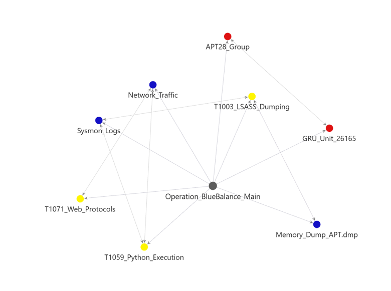

# **References & Resources**

|   |   |
|---|---|
|**MITRE ATT&CK**|**[https://attack.mitre.org](https://attack.mitre.org/)**|
|**Suricata Docs**|[https://docs.suricata.io/en/latest/rules/](https://docs.suricata.io/en/latest/rules/)|
|**Volatility 3 Docs**|[https://volatility3.readthedocs.io](https://volatility3.readthedocs.io/)|
|**Sysmon Sysinternals**|[https://docs.microsoft.com/en-us/sysinternals/downloads/sysmon](https://docs.microsoft.com/en-us/sysinternals/downloads/sysmon)|
|**Mimikatz GitHub**|[https://github.com/AnmaR3B/mimikatz](https://www.google.com/search?q=https://github.com/AnmaR3B/mimikatz)|
|**APT28 Group Profile**|[https://attack.mitre.org/groups/G0007/](https://attack.mitre.org/groups/G0007/)|